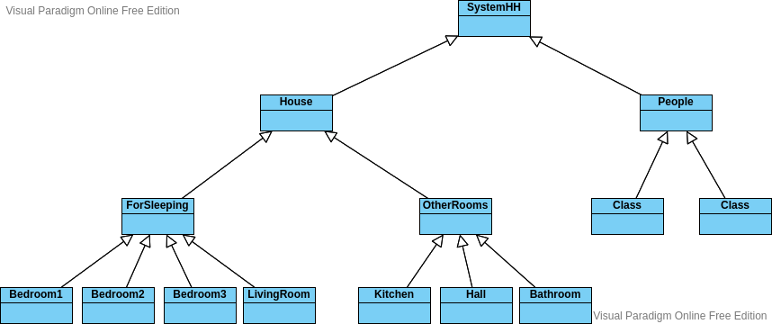

# Inheritance

<blockquote> <i>
“PAPE Satan, Pape Sat ` an, Aleppe!”  
Thus Plutus with his clucking voice began;  
And that benignant Sage, who all things knew,   
Said, to encourage me: “Let not thy fear 
Harm thee; for any power that he may have 
Shall not prevent thy going down this crag”</i></blockquote>
   

## Diagram:
 
