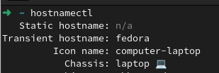
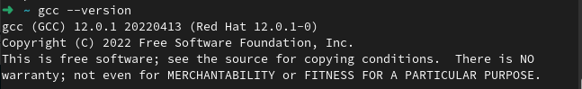
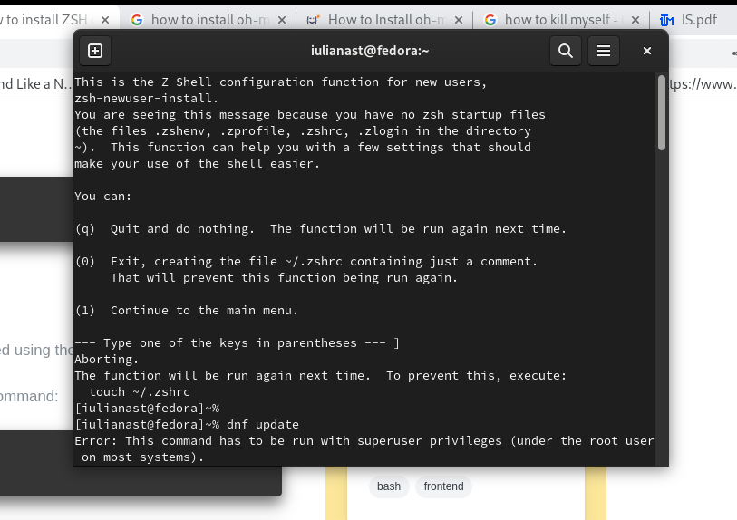
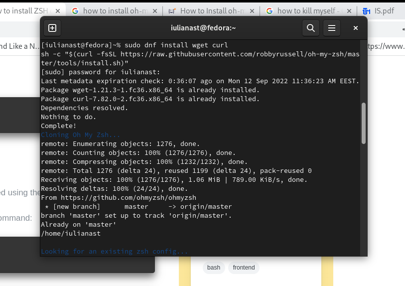
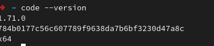
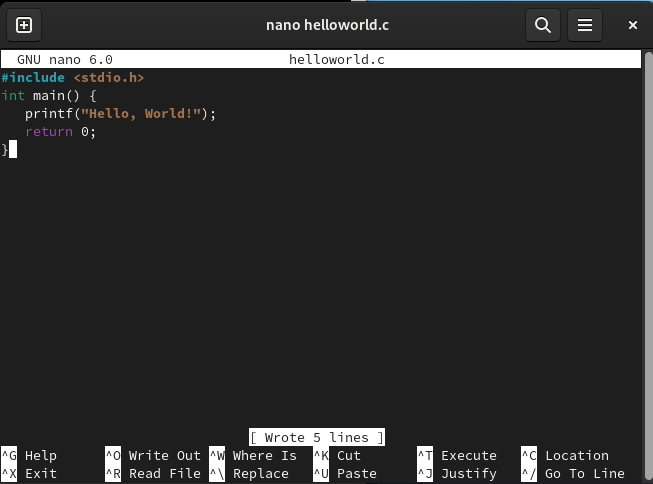
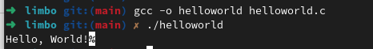
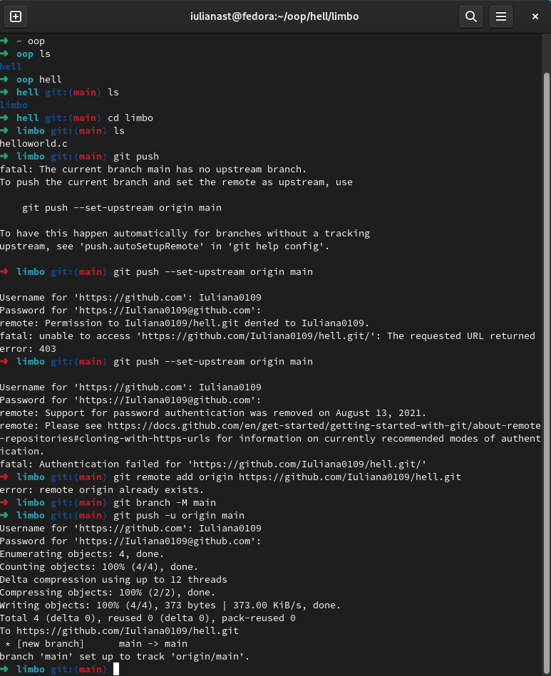

# Limbo
<blockquote> <i>
Broke the deep lethargy within my head  
A heavy thunder, so that I started,  
Like to a person who by force is wakened; 
  
And round about I moved my rested eyes,  
Uprisen erect, and steadfastly I gazed,  
To recognise the place wherein I was.</i></blockquote>
   
## Task 1:
I've installed Linux Fedora :'D  

## Task 2:
I've installed zsh, got, oh-my-zsh, vscode and gcc  

## Task 3:
I wrote a helloworld program in C:  

I compiled it:  

I created a repository and a directory in git:  

